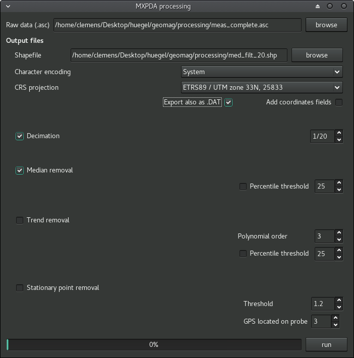

# barrow dataset

This dataset contains data from a 2017 survey project on Atlantis that targeted one specific field in the northern coastal plain. The following files are available:

- orthophoto (GeoTIFF)
- digital elevation model (GeoTIFF)
- magnetic survey data (probe-wise point data CSV + GeoTIFF)

## orthophoto

Georeferenced orthophoto of the site

gdalwarp -t_srs 'EPSG:32628' barrow2orto.tif barrow2orto_ref.tif

Geotiff examiner:
X - 
Y - 

gdal_translate \
  -co COMPRESS=JPEG \
  -co TILED=YES \
  -co JPEG_QUALITY=10 \
  barrow2orto_ref.tif barrow2orto_JPEG.tif


## digital elevation model

gdal_calc.py -A barrow2.tif --outfile=barrow2_low.tif --calc="A+74+27"

gdalwarp -t_srs 'EPSG:32628' barrow2_low.tif barrow2_ref.tif

Geotiff examiner:
X - 
Y - 

gdal_translate \
  -co COMPRESS=lzw \
  -co TILED=YES \
  -co PREDICTOR=2 \
  barrow2_ref.tif barrow2_LZW.tif

## magnetic survey data



```
# 1. compile magnetic measurements with position information from DGPS
# -> Software: DLMGPS http://www.sensysmagnetometer.com/en/dlmgps.html
# -> export as .asc

# 2. median filter and point count decimation 
# -> Software: AGT - Archaeological Geophysics Toolbox

# 3. manipulate position info https://github.com/narimanInrap/AGT
library(magrittr)

qgm <- readr::read_csv(
  "/home/clemens/Desktop/huegel/geomag/processing/med_filt_20.dat",
  col_names = c("x", "y", "magnetic_flux_in_nT", "meas_event", "probe")
  ) %>%
  dplyr::select(
    -meas_event
  ) 

qgm_sdf <- qgm
sp::coordinates(qgm_sdf) <- c("x", "y")
sp::proj4string(qgm_sdf) <- sp::CRS("+proj=utm +zone=33 +ellps=GRS80 +towgs84=0,0,0,0,0,0,0 +units=m +no_defs")
qgm_sdf <- sp::spTransform(qgm_sdf, sp::CRS("+proj=utm +zone=28 +datum=WGS84 +units=m +no_defs"))
qgm_trans <- as.data.frame(qgm_sdf)

qgm_cor <- qgm_trans %>%
  dplyr::mutate(
    x = x - ,
    y = y - 
  )

write.csv(qgm_cor, "/home/clemens/Desktop/huegel/geomag/processing/raw_data.csv")

# 4. raster interpolation
e <- raster::extent(qgm_cor[,c("x", "y")])
r <- raster::raster(e, ncol = 500, nrow = 500)

mag_rast <- raster::rasterize(
  qgm_cor[,c("x", "y")], 
  r, 
  qgm_cor[,"magnetic_flux_in_nT"], 
  fun = mean
)

raster::projection(mag_rast) <- "+proj=utm +zone=28 +datum=WGS84 +units=m +no_defs"

rasterVis::levelplot(mag_rast, at=-10:10)

fill.na <- function(x, i = 13) {
  if(is.na(x)[i]) {
    return(mean(x, na.rm=TRUE))
  } else {
    return(x[i])
  }
}  

mag_rast2 <- focal(mag_rast, w = matrix(1,5,5), fun = fill.na, 
               pad = TRUE, na.rm = FALSE )

rasterVis::levelplot(mag_rast2, at=-10:10)

writeRaster(mag_rast2, "/home/clemens/Desktop/huegel/geomag/processing/res2.tif", overwrite = TRUE)

```